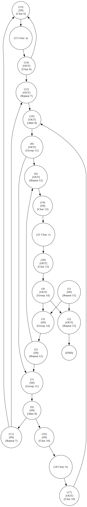

## Curious Regex

A learning project exploring different ways to implement a regular expression matching engine.

The grammar of this regular expression is simplified, but still retains its most intriguing features: nested parentheses, branching, and repetition (for example, `((a*|b)*c)*`. 

The EBNF definition is as follows:

```
expr    ::= contact { "|" contact }
contact ::= factor { factor }
factor  ::= atom [ "*" ]
atom    ::= char | "(" expr ")"
```

Since the regular expression language provides a higher-level framework for generating arbitrary regular languages, defining its universal structure requires a context-free grammar (CFG). 

Consequently, because this syntax is context-free, a specifically designed pushdown automaton (PDA) is employed to parse arbitrary regular expressions into an abstract syntax tree (AST). This AST represents the underlying regular grammar and serves as the basis for constructing a concrete finite automaton.

### Parser & Abstract Syntax Tree (AST) 

According to the EBNF definition, the `Parser` parses the expression using the Recursive descent algorithm and returns an abstract syntax tree as follows:

- AST of `((a*|b)*c)*`

```
[Contact 1]: 
    [Repeat 15]: 
        [Group 14]: 
            [Contact 3]: 
                [Repeat 12]: 
                    [Group 11]: 
                        [Alter 8]: 
                            Left:
                            [Contact 5]: 
                                [Repeat 7]: 
                                    [Char 6]: a
                            Right:
                            [Contact 9]: 
                                [Char 10]: b

                [Char 13]: c
```

###  Builder & Nondeterministic finite automaton (NFA)

The builder takes the Abstract Syntax Tree (AST) and applies Thompson's construction algorithm to generate the NFA.



### Matching engine

Now that we have the NFA, there are multiple ways to matching the target string.

#### Backtrack engine
This engine walks through only one path at a time. However, since some states in the NFA have two outgoing transitions, it pushes the second state onto a global backtrack stack as a backup path. When a path fails, the engine pops a backup path and tries again

#### Parallel engine
This engine does not backtrack. Instead, it finds all reachable next states at once and stores them in a set (the algorithm should pass through ε-state, but stop at other types of states). If any of these states accept the character, it advances one character in the string, computes all reachable next states from the accepted states, and tries the next character. If all characters in the string are consumed and the END state is in the final active set, the engine returns true.

#### DFA engine (Deterministic finite automaton)

> **Status:** *Work in Progress / TODO*

This engine converts the NFA to a DFA first, and then matches the target string using the DFA.
